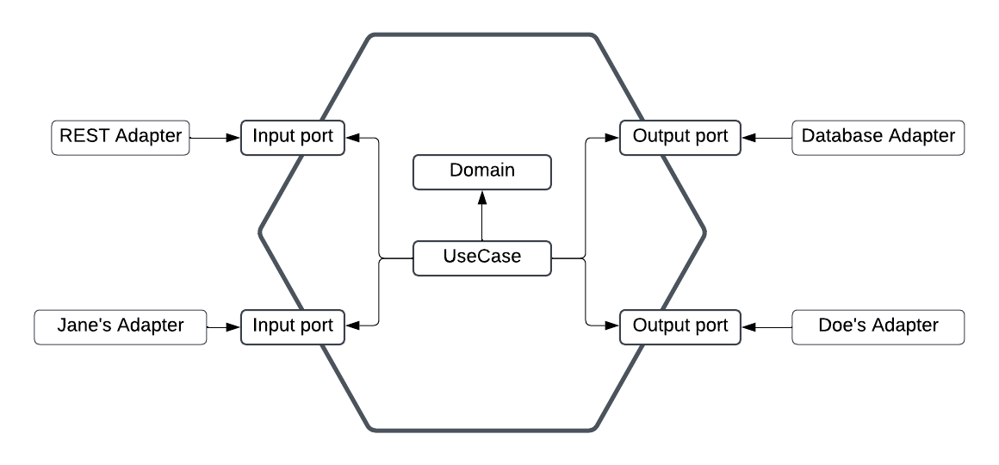
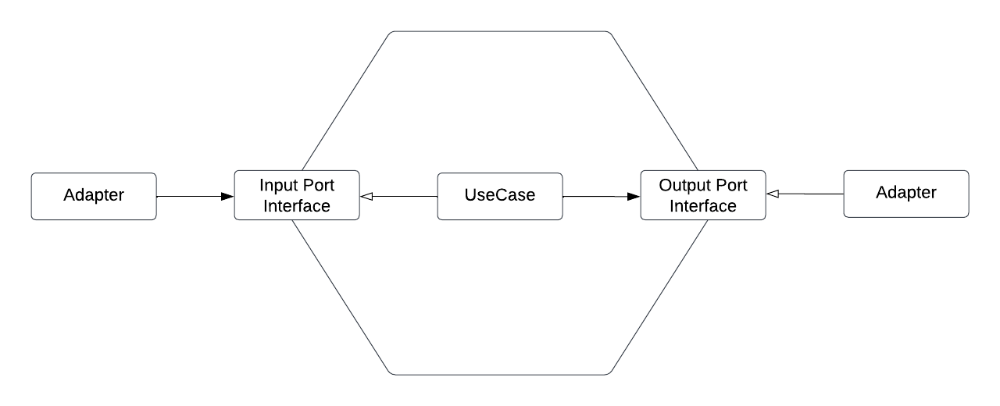

# Architecture overview :question:

Ports and adapters, also known as hexagonal architecture, is a software architecture pattern that aims to decouple the application core from the delivery mechanisms. It is a way to organize the code in a clean and maintainable way.

The way we achive this decoupling is basically by having a core module that contains the business logic and a module for each delivery mechanism. The core module is the only one that can access the delivery mechanisms, but the delivery mechanisms can't access the core module.

Thanks to the ports and adapters pattern, we can easily change the delivery mechanism without affecting the core module. For example, if we want to change from a REST API to a GraphQL API, we just need to create a new module for the GraphQL API and implement the adapters for the GraphQL API. The core module will remain the same.

The ports are just interfaces that we implement to achieve
dependency inversion.

